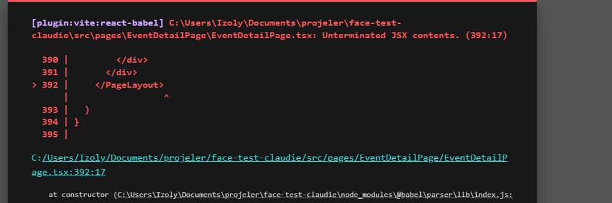

# 📚 Event Photos Platform - API Documentation

## 🔗 Base URL
```
https://api.example.com/api/v1
```

## 🔐 Authentication
- **Type**: Bearer Token (Firebase ID Token)
- **Header**: `Authorization: Bearer {idToken}`
- **Token Source**: Firebase Authentication
- **Token Expiration**: 1 hour (auto-refresh by Firebase SDK)

---

## 📋 Table of Contents
1. [Authentication Endpoints](#authentication-endpoints)
2. [User Management](#user-management)
3. [Events Management](#events-management)
4. [Photos Management](#photos-management)
5. [Participants Management](#participants-management)
6. [Shared/Public Endpoints](#sharedpublic-endpoints)
7. [Error Handling](#error-handling)
8. [Data Types](#data-types)

---

## Authentication Endpoints

### 1. User Registration
**Endpoint**: `POST /auth/signup`

**Description**: Create a new user account with email and password

**Request Body**:
```json
{
  "email": "user@example.com",
  "password": "SecurePassword123!",
  "name": "John Doe"
}
```

**Response** (201 Created):
```json
{
  "user": {
    "id": "user_12345",
    "email": "user@example.com",
    "name": "John Doe",
    "avatar": null,
    "subscription": "free",
    "photoCount": 0,
    "maxPhotos": 50,
    "createdAt": "2025-11-28T10:30:00Z",
    "updatedAt": "2025-11-28T10:30:00Z"
  },
  "tokens": {
    "accessToken": "eyJhbGciOiJIUzI1NiIsInR5cCI6IkpXVCJ9...",
    "expiresIn": 3600
  }
}
```

**Error Responses**:
- `400 Bad Request`: Missing or invalid fields
- `409 Conflict`: Email already registered

---

### 2. Email Login
**Endpoint**: `POST /auth/login/email`

**Description**: Sign in with email and password

**Request Body**:
```json
{
  "email": "user@example.com",
  "password": "SecurePassword123!"
}
```

**Response** (200 OK):
```json
{
  "user": {
    "id": "user_12345",
    "email": "user@example.com",
    "name": "John Doe",
    "avatar": null,
    "subscription": "free",
    "photoCount": 0,
    "maxPhotos": 50,
    "createdAt": "2025-11-28T10:30:00Z",
    "updatedAt": "2025-11-28T10:30:00Z"
  },
  "tokens": {
    "accessToken": "eyJhbGciOiJIUzI1NiIsInR5cCI6IkpXVCJ9...",
    "expiresIn": 3600
  }
}
```

**Error Responses**:
- `401 Unauthorized`: Invalid credentials
- `404 Not Found`: User doesn't exist

---

### 3. Google Login
**Endpoint**: `POST /auth/login/google`

**Description**: Sign in or create account via Google OAuth

**Request Body**:
```json
{
  "idToken": "eyJhbGciOiJSUzI1NiIsImtpZCI6IjEifQ...",
  "googleId": "118244711427411653604"
}
```

**Response** (200 OK or 201 Created):
```json
{
  "user": {
    "id": "google_118244711427411653604",
    "email": "user@gmail.com",
    "name": "John Doe",
    "avatar": "https://lh3.googleusercontent.com/...",
    "subscription": "free",
    "photoCount": 0,
    "maxPhotos": 50,
    "createdAt": "2025-11-28T10:30:00Z",
    "updatedAt": "2025-11-28T10:30:00Z"
  },
  "tokens": {
    "accessToken": "eyJhbGciOiJIUzI1NiIsInR5cCI6IkpXVCJ9...",
    "expiresIn": 3600
  }
}
```

**Error Responses**:
- `400 Bad Request`: Invalid token
- `401 Unauthorized`: Token verification failed

---

### 4. Apple Login
**Endpoint**: `POST /auth/login/apple`

**Description**: Sign in or create account via Apple OAuth

**Request Body**:
```json
{
  "identityToken": "eyJhbGciOiJSUzI1NiIsInR5cCI6IkpXVCJ9...",
  "user": {
    "name": {
      "firstName": "John",
      "lastName": "Doe"
    },
    "email": "user@privaterelay.appleid.com"
  }
}
```

**Response** (200 OK or 201 Created):
```json
{
  "user": {
    "id": "apple_001234567890",
    "email": "user@privaterelay.appleid.com",
    "name": "John Doe",
    "avatar": null,
    "subscription": "free",
    "photoCount": 0,
    "maxPhotos": 50,
    "createdAt": "2025-11-28T10:30:00Z",
    "updatedAt": "2025-11-28T10:30:00Z"
  },
  "tokens": {
    "accessToken": "eyJhbGciOiJIUzI1NiIsInR5cCI6IkpXVCJ9...",
    "expiresIn": 3600
  }
}
```

**Error Responses**:
- `400 Bad Request`: Invalid token
- `401 Unauthorized`: Token verification failed

---

### 5. Logout
**Endpoint**: `POST /auth/logout`

**Description**: Sign out user and invalidate token

**Authentication**: Required ✅

**Request Body**: `{}`

**Response** (200 OK):
```json
{
  "message": "Başarıyla çıkış yapıldı",
  "success": true
}
```

**Error Responses**:
- `401 Unauthorized`: Invalid or expired token

---

### 6. Refresh Token
**Endpoint**: `POST /auth/refresh`

**Description**: Get new access token using refresh token

**Request Body**:
```json
{
  "refreshToken": "eyJhbGciOiJIUzI1NiIsInR5cCI6IkpXVCJ9..."
}
```

**Response** (200 OK):
```json
{
  "accessToken": "eyJhbGciOiJIUzI1NiIsInR5cCI6IkpXVCJ9...",
  "expiresIn": 3600
}
```

**Error Responses**:
- `401 Unauthorized`: Invalid refresh token

---

## User Management

### 7. Get Current User
**Endpoint**: `GET /auth/me`

**Description**: Get logged-in user's profile

**Authentication**: Required ✅

**Response** (200 OK):
```json
{
  "id": "user_12345",
  "email": "user@example.com",
  "name": "John Doe",
  "avatar": "https://example.com/avatar.jpg",
  "subscription": "free",
  "photoCount": 5,
  "maxPhotos": 50,
  "createdAt": "2025-11-28T10:30:00Z",
  "updatedAt": "2025-11-28T11:00:00Z"
}
```

**Error Responses**:
- `401 Unauthorized`: Not authenticated

---

### 8. Update User Profile
**Endpoint**: `PUT /users/{userId}`

**Description**: Update user profile information

**Authentication**: Required ✅

**URL Parameters**:
- `userId` (string, required): User ID

**Request Body**:
```json
{
  "name": "John Smith",
  "avatar": "https://example.com/new-avatar.jpg"
}
```

**Response** (200 OK):
```json
{
  "id": "user_12345",
  "email": "user@example.com",
  "name": "John Smith",
  "avatar": "https://example.com/new-avatar.jpg",
  "subscription": "free",
  "photoCount": 5,
  "maxPhotos": 50,
  "createdAt": "2025-11-28T10:30:00Z",
  "updatedAt": "2025-11-28T11:15:00Z"
}
```

**Error Responses**:
- `401 Unauthorized`: Not authenticated
- `403 Forbidden`: Cannot modify other user's profile
- `404 Not Found`: User not found

---

### 9. Get User Subscription Details
**Endpoint**: `GET /users/{userId}/subscription`

**Description**: Get subscription plan and limits

**Authentication**: Required ✅

**URL Parameters**:
- `userId` (string, required): User ID

**Response** (200 OK):
```json
{
  "userId": "user_12345",
  "subscription": "free",
  "photoCount": 5,
  "maxPhotos": 50,
  "eventCount": 1,
  "maxEvents": 1,
  "storageUsed": 2147483648,
  "storageLimit": 5368709120,
  "subscriptionStartDate": "2025-11-28T10:30:00Z",
  "subscriptionEndDate": null,
  "autoRenew": false
}
```

**Error Responses**:
- `401 Unauthorized`: Not authenticated
- `404 Not Found`: User not found

---

### 10. Upgrade to Premium
**Endpoint**: `POST /users/{userId}/upgrade`

**Description**: Upgrade user subscription to premium

**Authentication**: Required ✅

**URL Parameters**:
- `userId` (string, required): User ID

**Request Body**:
```json
{
  "paymentMethodId": "pm_1234567890",
  "plan": "premium_monthly"
}
```

**Response** (200 OK):
```json
{
  "id": "user_12345",
  "email": "user@example.com",
  "name": "John Doe",
  "avatar": "https://example.com/avatar.jpg",
  "subscription": "premium",
  "photoCount": 5,
  "maxPhotos": 999999,
  "createdAt": "2025-11-28T10:30:00Z",
  "updatedAt": "2025-11-28T11:20:00Z"
}
```

**Error Responses**:
- `401 Unauthorized`: Not authenticated
- `402 Payment Required`: Payment failed
- `404 Not Found`: User not found

---

## Events Management

### 11. Create Event
**Endpoint**: `POST /events`

**Description**: Create a new event

**Authentication**: Required ✅

**Request Body**:
```json
{
  "title": "Family Reunion 2025",
  "description": "Annual family gathering at the beach",
  "status": "draft"
}
```

**Response** (201 Created):
```json
{
  "id": "event_abc123xyz",
  "title": "Family Reunion 2025",
  "description": "Annual family gathering at the beach",
  "organizerId": "user_12345",
  "status": "draft",
  "shareLink": "https://app.example.com/events/abc123xyz",
  "qrCode": "data:image/png;base64,iVBORw0KGgoAAAANSUhEUgAAAAUA...",
  "participants": ["user_12345"],
  "photoIds": [],
  "createdAt": "2025-11-28T12:00:00Z",
  "updatedAt": "2025-11-28T12:00:00Z"
}
```

**Error Responses**:
- `400 Bad Request`: Invalid input
- `401 Unauthorized`: Not authenticated
- `402 Payment Required`: Event limit reached (free plan)
- `413 Payload Too Large`: Description too long

---

### 12. Get Event Details
**Endpoint**: `GET /events/{eventId}`

**Description**: Get event details (organizer only or if joined)

**Authentication**: Required ✅

**URL Parameters**:
- `eventId` (string, required): Event ID

**Query Parameters**:
- `includePhotos` (boolean, optional): Include photo list in response (default: false)

**Response** (200 OK):
```json
{
  "id": "event_abc123xyz",
  "title": "Family Reunion 2025",
  "description": "Annual family gathering at the beach",
  "organizerId": "user_12345",
  "status": "draft",
  "shareLink": "https://app.example.com/events/abc123xyz",
  "qrCode": "data:image/png;base64,iVBORw0KGgoAAAANSUhEUgAAAAUA...",
  "participants": [
    {
      "id": "user_12345",
      "name": "John Doe",
      "email": "john@example.com"
    },
    {
      "id": "user_67890",
      "name": "Jane Smith",
      "email": "jane@example.com"
    }
  ],
  "photoIds": [
    "photo_001",
    "photo_002"
  ],
  "photosCount": 2,
  "createdAt": "2025-11-28T12:00:00Z",
  "updatedAt": "2025-11-28T13:30:00Z"
}
```

**Error Responses**:
- `401 Unauthorized`: Not authenticated
- `403 Forbidden`: No access to this event
- `404 Not Found`: Event not found

---

### 13. Get User Events
**Endpoint**: `GET /events`

**Description**: Get all events created by logged-in user

**Authentication**: Required ✅

**Query Parameters**:
- `status` (string, optional): Filter by status (draft, active, completed)
- `limit` (number, optional): Limit results (default: 20, max: 100)
- `offset` (number, optional): Pagination offset (default: 0)
- `sortBy` (string, optional): Sort field (createdAt, updatedAt, title)
- `sortOrder` (string, optional): Sort direction (asc, desc)

**Response** (200 OK):
```json
{
  "data": [
    {
      "id": "event_abc123xyz",
      "title": "Family Reunion 2025",
      "description": "Annual family gathering at the beach",
      "organizerId": "user_12345",
      "status": "draft",
      "shareLink": "https://app.example.com/events/abc123xyz",
      "qrCode": "data:image/png;base64,iVBORw0KGgoAAAANSUhEUgAAAAUA...",
      "participants": ["user_12345", "user_67890"],
      "photoIds": ["photo_001", "photo_002"],
      "createdAt": "2025-11-28T12:00:00Z",
      "updatedAt": "2025-11-28T13:30:00Z"
    }
  ],
  "pagination": {
    "total": 5,
    "limit": 20,
    "offset": 0,
    "pages": 1
  }
}
```

**Error Responses**:
- `401 Unauthorized`: Not authenticated

---

### 14. Update Event
**Endpoint**: `PUT /events/{eventId}`

**Description**: Update event details (organizer only)

**Authentication**: Required ✅

**URL Parameters**:
- `eventId` (string, required): Event ID

**Request Body** (all fields optional):
```json
{
  "title": "Family Reunion 2025 - Updated",
  "description": "Updated description",
  "status": "active"
}
```

**Response** (200 OK):
```json
{
  "id": "event_abc123xyz",
  "title": "Family Reunion 2025 - Updated",
  "description": "Updated description",
  "organizerId": "user_12345",
  "status": "active",
  "shareLink": "https://app.example.com/events/abc123xyz",
  "qrCode": "data:image/png;base64,iVBORw0KGgoAAAANSUhEUgAAAAUA...",
  "participants": ["user_12345", "user_67890"],
  "photoIds": ["photo_001", "photo_002"],
  "createdAt": "2025-11-28T12:00:00Z",
  "updatedAt": "2025-11-28T14:00:00Z"
}
```

**Error Responses**:
- `400 Bad Request`: Invalid input
- `401 Unauthorized`: Not authenticated
- `403 Forbidden`: Not event organizer
- `404 Not Found`: Event not found

---

### 15. Delete Event
**Endpoint**: `DELETE /events/{eventId}`

**Description**: Delete event and all associated photos (organizer only)

**Authentication**: Required ✅

**URL Parameters**:
- `eventId` (string, required): Event ID

**Response** (204 No Content or 200 OK):
```json
{
  "message": "Event başarıyla silindi",
  "success": true
}
```

**Error Responses**:
- `401 Unauthorized`: Not authenticated
- `403 Forbidden`: Not event organizer
- `404 Not Found`: Event not found

---

## Photos Management

### 16. Upload Photo
**Endpoint**: `POST /events/{eventId}/photos`

**Description**: Upload a photo to event

**Authentication**: Required ✅

**URL Parameters**:
- `eventId` (string, required): Event ID

**Request Headers**:
- `Content-Type: multipart/form-data`

**Request Body** (multipart):
```
file: <binary image file>
tags: ["beach", "sunset"] (optional, JSON string)
```

**Response** (201 Created):
```json
{
  "id": "photo_001",
  "eventId": "event_abc123xyz",
  "userId": "user_12345",
  "uploadedBy": "John Doe",
  "url": "https://cdn.example.com/photos/event_abc123xyz/photo_001.jpg",
  "fileName": "family_photo.jpg",
  "size": 2048576,
  "mimeType": "image/jpeg",
  "uploadedAt": "2025-11-28T12:30:00Z"
}
```

**Error Responses**:
- `400 Bad Request`: Invalid file format or size
- `401 Unauthorized`: Not authenticated
- `402 Payment Required`: Storage limit exceeded
- `403 Forbidden`: Not a participant in this event
- `404 Not Found`: Event not found
- `413 Payload Too Large`: File size exceeds limit (max 50MB)

**Accepted File Types**: `image/jpeg`, `image/png`, `image/webp`, `image/heic`

---

### 17. Get Event Photos
**Endpoint**: `GET /events/{eventId}/photos`

**Description**: Get all photos in an event

**Authentication**: Required ✅

**URL Parameters**:
- `eventId` (string, required): Event ID

**Query Parameters**:
- `limit` (number, optional): Limit results (default: 20, max: 100)
- `offset` (number, optional): Pagination offset (default: 0)
- `sortBy` (string, optional): Sort field (uploadedAt, fileName)
- `sortOrder` (string, optional): Sort direction (asc, desc)

**Response** (200 OK):
```json
{
  "data": [
    {
      "id": "photo_001",
      "eventId": "event_abc123xyz",
      "userId": "user_12345",
      "uploadedBy": "John Doe",
      "url": "https://cdn.example.com/photos/event_abc123xyz/photo_001.jpg",
      "thumbnailUrl": "https://cdn.example.com/thumbnails/event_abc123xyz/photo_001.jpg",
      "fileName": "family_photo.jpg",
      "size": 2048576,
      "mimeType": "image/jpeg",
      "uploadedAt": "2025-11-28T12:30:00Z"
    }
  ],
  "pagination": {
    "total": 10,
    "limit": 20,
    "offset": 0,
    "pages": 1
  }
}
```

**Error Responses**:
- `401 Unauthorized`: Not authenticated
- `403 Forbidden`: No access to this event
- `404 Not Found`: Event not found

---

### 18. Delete Photo
**Endpoint**: `DELETE /events/{eventId}/photos/{photoId}`

**Description**: Delete a specific photo

**Authentication**: Required ✅

**URL Parameters**:
- `eventId` (string, required): Event ID
- `photoId` (string, required): Photo ID

**Response** (204 No Content or 200 OK):
```json
{
  "message": "Fotoğraf başarıyla silindi",
  "success": true
}
```

**Error Responses**:
- `401 Unauthorized`: Not authenticated
- `403 Forbidden`: Not photo uploader or event organizer
- `404 Not Found`: Photo or event not found

---

### 19. Get Photo Details
**Endpoint**: `GET /events/{eventId}/photos/{photoId}`

**Description**: Get detailed information about a photo

**Authentication**: Required ✅

**URL Parameters**:
- `eventId` (string, required): Event ID
- `photoId` (string, required): Photo ID

**Response** (200 OK):
```json
{
  "id": "photo_001",
  "eventId": "event_abc123xyz",
  "userId": "user_12345",
  "uploadedBy": "John Doe",
  "url": "https://cdn.example.com/photos/event_abc123xyz/photo_001.jpg",
  "thumbnailUrl": "https://cdn.example.com/thumbnails/event_abc123xyz/photo_001.jpg",
  "fileName": "family_photo.jpg",
  "size": 2048576,
  "mimeType": "image/jpeg",
  "uploadedAt": "2025-11-28T12:30:00Z",
  "metadata": {
    "width": 4000,
    "height": 3000,
    "orientation": 1,
    "camera": "iPhone 13 Pro",
    "dateTaken": "2025-11-28T10:15:00Z"
  }
}
```

**Error Responses**:
- `401 Unauthorized`: Not authenticated
- `403 Forbidden`: No access to this event
- `404 Not Found`: Photo or event not found

---

## Participants Management

### 20. Add Event Participant
**Endpoint**: `POST /events/{eventId}/participants`

**Description**: Add user as participant to event

**Authentication**: Required ✅

**URL Parameters**:
- `eventId` (string, required): Event ID

**Request Body**:
```json
{
  "userId": "user_67890"
}
```

**Response** (201 Created):
```json
{
  "eventId": "event_abc123xyz",
  "userId": "user_67890",
  "joinedAt": "2025-11-28T13:00:00Z",
  "role": "participant"
}
```

**Error Responses**:
- `400 Bad Request`: User already a participant
- `401 Unauthorized`: Not authenticated
- `403 Forbidden`: Not event organizer
- `404 Not Found`: Event or user not found

---

### 21. Get Event Participants
**Endpoint**: `GET /events/{eventId}/participants`

**Description**: Get all participants of an event

**Authentication**: Required ✅

**URL Parameters**:
- `eventId` (string, required): Event ID

**Query Parameters**:
- `limit` (number, optional): Limit results (default: 20, max: 100)
- `offset` (number, optional): Pagination offset (default: 0)

**Response** (200 OK):
```json
{
  "data": [
    {
      "id": "user_12345",
      "name": "John Doe",
      "email": "john@example.com",
      "avatar": "https://example.com/avatar.jpg",
      "role": "organizer",
      "joinedAt": "2025-11-28T12:00:00Z"
    },
    {
      "id": "user_67890",
      "name": "Jane Smith",
      "email": "jane@example.com",
      "avatar": "https://example.com/avatar2.jpg",
      "role": "participant",
      "joinedAt": "2025-11-28T13:00:00Z"
    }
  ],
  "pagination": {
    "total": 2,
    "limit": 20,
    "offset": 0,
    "pages": 1
  }
}
```

**Error Responses**:
- `401 Unauthorized`: Not authenticated
- `403 Forbidden`: No access to this event
- `404 Not Found`: Event not found

---

### 22. Remove Participant
**Endpoint**: `DELETE /events/{eventId}/participants/{userId}`

**Description**: Remove a participant from event (organizer only)

**Authentication**: Required ✅

**URL Parameters**:
- `eventId` (string, required): Event ID
- `userId` (string, required): User ID to remove

**Response** (204 No Content or 200 OK):
```json
{
  "message": "Katılımcı başarıyla çıkarıldı",
  "success": true
}
```

**Error Responses**:
- `401 Unauthorized`: Not authenticated
- `403 Forbidden`: Not event organizer
- `404 Not Found`: Event or participant not found

---

### 23. Join Event by Share Link
**Endpoint**: `POST /events/join`

**Description**: Join event using share link (public endpoint)

**Authentication**: Required ✅ (but user auto-added to participants)

**Request Body**:
```json
{
  "shareLink": "https://app.example.com/events/abc123xyz"
}
```

**Response** (200 OK or 201 Created):
```json
{
  "id": "event_abc123xyz",
  "title": "Family Reunion 2025",
  "description": "Annual family gathering at the beach",
  "organizerId": "user_12345",
  "status": "active",
  "shareLink": "https://app.example.com/events/abc123xyz",
  "qrCode": "data:image/png;base64,iVBORw0KGgoAAAANSUhEUgAAAAUA...",
  "participants": ["user_12345", "user_67890"],
  "photoIds": ["photo_001", "photo_002"],
  "createdAt": "2025-11-28T12:00:00Z",
  "updatedAt": "2025-11-28T13:30:00Z"
}
```

**Error Responses**:
- `401 Unauthorized`: Not authenticated
- `404 Not Found`: Event not found
- `410 Gone`: Event has been deleted or access revoked

---

## Shared/Public Endpoints

### 24. Get Public Event (No Auth)
**Endpoint**: `GET /public/events/{shareToken}`

**Description**: Get event data using share token (no authentication required)

**URL Parameters**:
- `shareToken` (string, required): Share token from event's public link

**Response** (200 OK):
```json
{
  "id": "event_abc123xyz",
  "title": "Family Reunion 2025",
  "description": "Annual family gathering at the beach",
  "organizerName": "John Doe",
  "status": "active",
  "participantsCount": 2,
  "photosCount": 10,
  "createdAt": "2025-11-28T12:00:00Z"
}
```

**Error Responses**:
- `404 Not Found`: Event not found or access revoked

---

### 25. Get Public Event Photos (No Auth)
**Endpoint**: `GET /public/events/{shareToken}/photos`

**Description**: Get all photos from event using share token (no auth required)

**URL Parameters**:
- `shareToken` (string, required): Share token from event's public link

**Query Parameters**:
- `limit` (number, optional): Limit results (default: 20, max: 100)
- `offset` (number, optional): Pagination offset (default: 0)

**Response** (200 OK):
```json
{
  "data": [
    {
      "id": "photo_001",
      "fileName": "family_photo.jpg",
      "url": "https://cdn.example.com/photos/event_abc123xyz/photo_001.jpg",
      "thumbnailUrl": "https://cdn.example.com/thumbnails/event_abc123xyz/photo_001.jpg",
      "uploadedBy": "John Doe",
      "uploadedAt": "2025-11-28T12:30:00Z"
    }
  ],
  "pagination": {
    "total": 10,
    "limit": 20,
    "offset": 0,
    "pages": 1
  }
}
```

**Error Responses**:
- `404 Not Found`: Event not found or access revoked

---

## Face Recognition Endpoints

### 26. Detect Faces in Photo
**Endpoint**: `POST /photos/{photoId}/detect-faces`

**Description**: Run face detection on a photo

**Authentication**: Required ✅

**URL Parameters**:
- `photoId` (string, required): Photo ID

**Request Body**:
```json
{
  "model": "default"
}
```

**Response** (200 OK):
```json
{
  "photoId": "photo_001",
  "facesDetected": 3,
  "faces": [
    {
      "faceId": "face_001",
      "confidence": 0.98,
      "boundingBox": {
        "x": 100,
        "y": 150,
        "width": 200,
        "height": 250
      },
      "landmarks": {
        "leftEye": { "x": 150, "y": 200 },
        "rightEye": { "x": 250, "y": 200 },
        "nose": { "x": 200, "y": 240 },
        "mouth": { "x": 200, "y": 280 }
      }
    }
  ]
}
```

**Error Responses**:
- `401 Unauthorized`: Not authenticated
- `402 Payment Required`: Face recognition limit exceeded
- `404 Not Found`: Photo not found

---

### 27. Find Faces in Event Photos
**Endpoint**: `POST /events/{eventId}/find-faces`

**Description**: Find all occurrences of a specific face across event photos

**Authentication**: Required ✅

**URL Parameters**:
- `eventId` (string, required): Event ID

**Request Body**:
```json
{
  "faceId": "face_001",
  "threshold": 0.85
}
```

**Response** (200 OK):
```json
{
  "faceId": "face_001",
  "matches": [
    {
      "photoId": "photo_001",
      "fileName": "family_photo.jpg",
      "url": "https://cdn.example.com/photos/event_abc123xyz/photo_001.jpg",
      "confidence": 0.98,
      "boundingBox": {
        "x": 100,
        "y": 150,
        "width": 200,
        "height": 250
      },
      "uploadedBy": "John Doe",
      "uploadedAt": "2025-11-28T12:30:00Z"
    }
  ],
  "totalMatches": 5
}
```

**Error Responses**:
- `401 Unauthorized`: Not authenticated
- `402 Payment Required`: Face recognition limit exceeded
- `403 Forbidden`: No access to event
- `404 Not Found`: Event or face not found

---

### 28. Get Participant Photos
**Endpoint**: `GET /events/{eventId}/participant-photos/{userId}`

**Description**: Get all photos containing a specific participant across event

**Authentication**: Required ✅

**URL Parameters**:
- `eventId` (string, required): Event ID
- `userId` (string, required): Participant user ID

**Query Parameters**:
- `limit` (number, optional): Limit results (default: 20, max: 100)
- `offset` (number, optional): Pagination offset (default: 0)
- `minConfidence` (number, optional): Minimum confidence threshold (default: 0.7)

**Response** (200 OK):
```json
{
  "eventId": "event_abc123xyz",
  "userId": "user_67890",
  "userName": "Jane Smith",
  "data": [
    {
      "photoId": "photo_001",
      "fileName": "family_photo.jpg",
      "url": "https://cdn.example.com/photos/event_abc123xyz/photo_001.jpg",
      "thumbnailUrl": "https://cdn.example.com/thumbnails/event_abc123xyz/photo_001.jpg",
      "confidence": 0.96,
      "uploadedBy": "John Doe",
      "uploadedAt": "2025-11-28T12:30:00Z"
    }
  ],
  "pagination": {
    "total": 8,
    "limit": 20,
    "offset": 0,
    "pages": 1
  }
}
```

**Error Responses**:
- `401 Unauthorized`: Not authenticated
- `402 Payment Required`: Face recognition limit exceeded
- `403 Forbidden`: No access to event
- `404 Not Found`: Event or user not found

---

## Search & Filter Endpoints

### 29. Search Events
**Endpoint**: `GET /events/search`

**Description**: Search user's events by title or description

**Authentication**: Required ✅

**Query Parameters**:
- `q` (string, required): Search query
- `status` (string, optional): Filter by status (draft, active, completed)
- `limit` (number, optional): Limit results (default: 20, max: 100)
- `offset` (number, optional): Pagination offset (default: 0)

**Response** (200 OK):
```json
{
  "data": [
    {
      "id": "event_abc123xyz",
      "title": "Family Reunion 2025",
      "description": "Annual family gathering at the beach",
      "organizerId": "user_12345",
      "status": "active",
      "participants": ["user_12345", "user_67890"],
      "photosCount": 15,
      "createdAt": "2025-11-28T12:00:00Z",
      "updatedAt": "2025-11-28T13:30:00Z"
    }
  ],
  "pagination": {
    "total": 1,
    "limit": 20,
    "offset": 0,
    "pages": 1
  }
}
```

**Error Responses**:
- `401 Unauthorized`: Not authenticated

---

## Statistics & Analytics Endpoints

### 30. Get Event Statistics
**Endpoint**: `GET /events/{eventId}/stats`

**Description**: Get event statistics (organizer only)

**Authentication**: Required ✅

**URL Parameters**:
- `eventId` (string, required): Event ID

**Response** (200 OK):
```json
{
  "eventId": "event_abc123xyz",
  "title": "Family Reunion 2025",
  "totalPhotos": 42,
  "totalParticipants": 15,
  "totalFacesDetected": 128,
  "uploadsByDay": [
    {
      "date": "2025-11-28",
      "count": 10
    }
  ],
  "topContributors": [
    {
      "userId": "user_12345",
      "name": "John Doe",
      "photoCount": 15
    }
  ],
  "storageUsed": 1073741824,
  "lastActivity": "2025-11-28T14:30:00Z"
}
```

**Error Responses**:
- `401 Unauthorized`: Not authenticated
- `403 Forbidden`: Not event organizer
- `404 Not Found`: Event not found

---

## Error Handling

### Standard Error Response Format

All error responses follow this format:

```json
{
  "error": {
    "code": "VALIDATION_ERROR",
    "message": "Doğrulama hatası",
    "details": [
      {
        "field": "email",
        "message": "Geçerli bir e-posta adresi girin"
      }
    ],
    "timestamp": "2025-11-28T14:30:00Z",
    "requestId": "req_12345"
  }
}
```

### Common Error Codes

| Code | HTTP Status | Description |
|------|-------------|-------------|
| `VALIDATION_ERROR` | 400 | Invalid request parameters |
| `AUTHENTICATION_REQUIRED` | 401 | User not authenticated |
| `INVALID_TOKEN` | 401 | Token is invalid or expired |
| `INSUFFICIENT_PERMISSIONS` | 403 | User doesn't have required permissions |
| `NOT_FOUND` | 404 | Resource not found |
| `CONFLICT` | 409 | Resource conflict (e.g., duplicate email) |
| `RATE_LIMIT_EXCEEDED` | 429 | Too many requests |
| `PAYMENT_REQUIRED` | 402 | Action requires upgrade or quota |
| `INTERNAL_SERVER_ERROR` | 500 | Internal server error |
| `SERVICE_UNAVAILABLE` | 503 | Service temporarily unavailable |

---

## Data Types

### User Object
```typescript
{
  id: string                              // Unique user identifier
  email: string                           // User email address
  name: string                            // User full name
  avatar?: string                         // Avatar image URL
  subscription: 'free' | 'premium'        // Current subscription plan
  photoCount: number                      // Number of photos uploaded
  maxPhotos: number                       // Photo limit for current plan
  createdAt: string                       // ISO 8601 timestamp
  updatedAt: string                       // ISO 8601 timestamp
}
```

### Event Object
```typescript
{
  id: string                              // Unique event identifier
  title: string                           // Event title
  description: string                     // Event description
  organizerId: string                     // Organizer's user ID
  status: 'draft' | 'active' | 'completed' // Event status
  shareLink: string                       // Unique share URL
  qrCode: string                          // QR code (base64 or URL)
  participants: string[]                  // Array of participant user IDs
  photoIds: string[]                      // Array of photo IDs
  createdAt: string                       // ISO 8601 timestamp
  updatedAt: string                       // ISO 8601 timestamp
}
```

### Photo Object
```typescript
{
  id: string                              // Unique photo identifier
  eventId: string                         // Associated event ID
  userId: string                          // Uploader's user ID
  uploadedBy: string                      // Uploader's name
  url: string                             // Full resolution image URL
  thumbnailUrl?: string                   // Thumbnail image URL
  fileName: string                        // Original file name
  size: number                            // File size in bytes
  mimeType: string                        // MIME type (e.g., image/jpeg)
  uploadedAt: string                      // ISO 8601 timestamp
}
```

### AuthTokens Object
```typescript
{
  accessToken: string                     // JWT access token
  refreshToken?: string                   // JWT refresh token
  expiresIn?: number                      // Token expiration in seconds
}
```

### FaceMatch Object
```typescript
{
  photoId: string                         // Photo ID containing the face
  confidence: number                      // Match confidence (0-1)
  boundingBox: {
    x: number                             // X coordinate
    y: number                             // Y coordinate
    width: number                         // Bounding box width
    height: number                        // Bounding box height
  }
}
```

---

## Rate Limiting

**Rate Limits** (per user, rolling window):
- **Free Plan**: 100 requests/hour
- **Premium Plan**: 1000 requests/hour
- **Face Detection**: 10 per hour (free), unlimited (premium)
- **File Upload**: 100MB/hour (free), 1GB/hour (premium)

**Headers Returned**:
```
X-RateLimit-Limit: 100
X-RateLimit-Remaining: 87
X-RateLimit-Reset: 1700000000
```

---

## Pagination

All list endpoints support pagination:

**Query Parameters**:
- `limit` (number): Items per page (default: 20, max: 100)
- `offset` (number): Skip this many items (default: 0)

**Response Format**:
```json
{
  "data": [...],
  "pagination": {
    "total": 150,
    "limit": 20,
    "offset": 0,
    "pages": 8
  }
}
```

---

## Webhooks (Optional)

### Event Webhooks
```
POST /webhooks/register

{
  "url": "https://your-server.com/webhook",
  "events": ["event.created", "event.updated", "photo.uploaded"],
  "secret": "webhook_secret_key"
}
```

**Webhook Events**:
- `event.created` - New event created
- `event.updated` - Event updated
- `event.deleted` - Event deleted
- `photo.uploaded` - New photo uploaded
- `participant.added` - Participant joined
- `participant.removed` - Participant removed
- `faces.detected` - Face detection completed

---

## Summary of All Endpoints

| # | Method | Endpoint | Auth | Purpose |
|---|--------|----------|------|---------|
| 1 | POST | `/auth/signup` | ❌ | User registration |
| 2 | POST | `/auth/login/email` | ❌ | Email login |
| 3 | POST | `/auth/login/google` | ❌ | Google login |
| 4 | POST | `/auth/login/apple` | ❌ | Apple login |
| 5 | POST | `/auth/logout` | ✅ | Sign out |
| 6 | POST | `/auth/refresh` | ❌ | Refresh token |
| 7 | GET | `/auth/me` | ✅ | Get current user |
| 8 | PUT | `/users/{userId}` | ✅ | Update profile |
| 9 | GET | `/users/{userId}/subscription` | ✅ | Get subscription info |
| 10 | POST | `/users/{userId}/upgrade` | ✅ | Upgrade to premium |
| 11 | POST | `/events` | ✅ | Create event |
| 12 | GET | `/events/{eventId}` | ✅ | Get event details |
| 13 | GET | `/events` | ✅ | List user events |
| 14 | PUT | `/events/{eventId}` | ✅ | Update event |
| 15 | DELETE | `/events/{eventId}` | ✅ | Delete event |
| 16 | POST | `/events/{eventId}/photos` | ✅ | Upload photo |
| 17 | GET | `/events/{eventId}/photos` | ✅ | List event photos |
| 18 | DELETE | `/events/{eventId}/photos/{photoId}` | ✅ | Delete photo |
| 19 | GET | `/events/{eventId}/photos/{photoId}` | ✅ | Get photo details |
| 20 | POST | `/events/{eventId}/participants` | ✅ | Add participant |
| 21 | GET | `/events/{eventId}/participants` | ✅ | List participants |
| 22 | DELETE | `/events/{eventId}/participants/{userId}` | ✅ | Remove participant |
| 23 | POST | `/events/join` | ✅ | Join by share link |
| 24 | GET | `/public/events/{shareToken}` | ❌ | Get public event |
| 25 | GET | `/public/events/{shareToken}/photos` | ❌ | Get public photos |
| 26 | POST | `/photos/{photoId}/detect-faces` | ✅ | Detect faces |
| 27 | POST | `/events/{eventId}/find-faces` | ✅ | Find face in photos |
| 28 | GET | `/events/{eventId}/participant-photos/{userId}` | ✅ | Get participant photos |
| 29 | GET | `/events/search` | ✅ | Search events |
| 30 | GET | `/events/{eventId}/stats` | ✅ | Get statistics |

---

## Implementation Checklist

- [ ] Database schema creation
- [ ] User authentication & authorization
- [ ] Event CRUD operations
- [ ] Photo upload & management
- [ ] Participant management
- [ ] Face detection integration
- [ ] Share link generation & QR codes
- [ ] Subscription & payment system
- [ ] File storage (AWS S3/Cloudinary)
- [ ] Rate limiting middleware
- [ ] Error handling & logging
- [ ] API documentation (Swagger/OpenAPI)
- [ ] Unit & integration tests
- [ ] Performance optimization (caching, CDN)
- [ ] Security (CORS, HTTPS, input validation)

---

**Last Updated**: November 28, 2025
**API Version**: v1
**Document Status**: Ready for Backend Development
